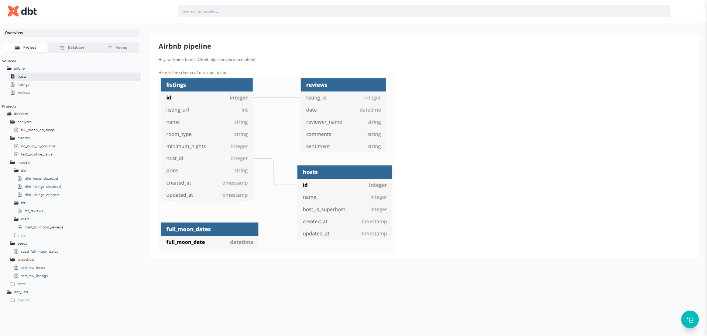

# Airbnb Data Transformation Project with dbt

This project involves transforming Airbnb data using dbt (Data Build Tool) to create a robust and maintainable data pipeline. The transformations are based on the "Complete dbt Bootcamp: Zero to Hero" course.

## Project Structure

The project is organized as follows:

- **Models**: SQL files defining the transformations.
- **Seeds**: CSV files with static data loaded into the warehouse.
- **Snapshots**: Capture and track changes in source data over time.
- **Analyses**: SQL queries for ad-hoc analysis.
- **Tests**: Ensure data quality and integrity.
- **Macros**: Reusable SQL snippets.
- **Hooks**: SQL statements executed before or after certain dbt operations.

## Progress Overview

1. **Models**: Developed models to transform raw Airbnb data into analytical tables.
2. **Seeds**: Loaded static data into the warehouse for reference in transformations.
3. **Snapshots**: Implemented snapshots to track historical changes in data.
4. **Analyses**: Created ad-hoc analyses to derive insights from the transformed data.
5. **Tests**: Added tests to validate data quality and integrity.
6. **Macros**: Defined reusable SQL snippets to streamline transformations.
7. **Hooks**: Utilized hooks to execute SQL statements at specific points in the dbt workflow.

## Proofs
1. **dbt documentation**

2. 

